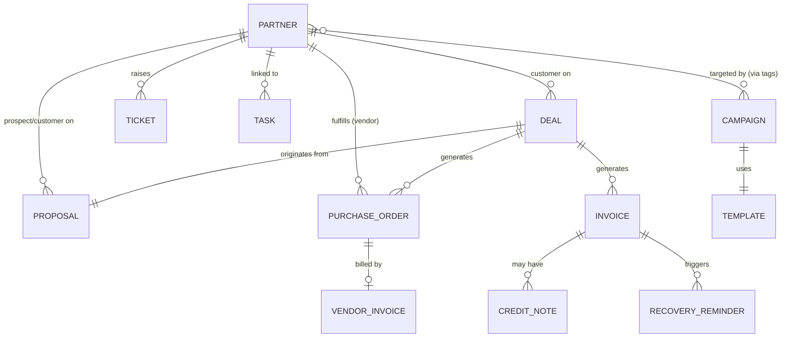
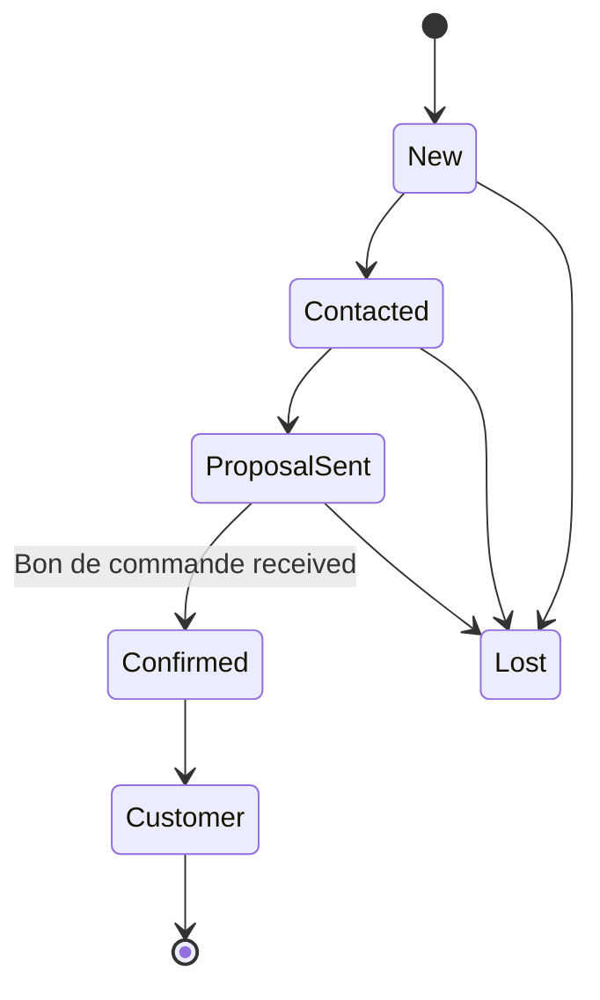
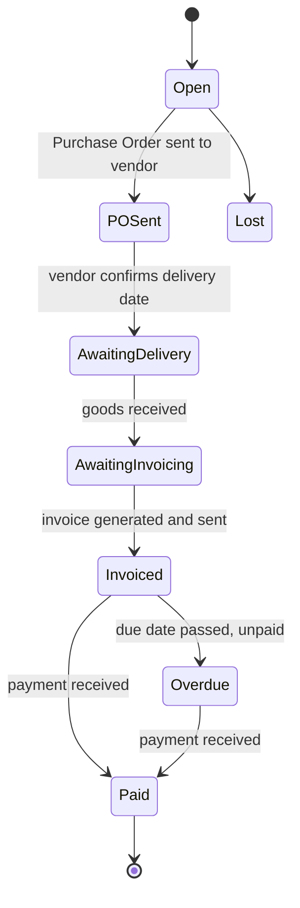

# CRM Implementation Plan

> This document reorganizes the raw requirements + the end-to-end scenario into a build-ready spec: data model, lifecycle states, module specs, shared services, integration points, open questions, and a phased build order. Sections marked **GAP** are things not fully specified in the source material — confirm them before or during the relevant phase rather than guessing mid-build.

---

## 1. How This Is Organized

Rather than building each of the six modules (Sales, Marketing, Analytics, Partners, Tickets, Finance) as independent silos, several pieces of functionality are *used by* multiple modules and should be built once as shared services:

- **Tasks** are created from Sales, but assigned to Operations and Finance teams too — it's a generic task engine, not a Sales-only feature.
- **Templates** are needed for Proposals, WhatsApp, SMS, and Email — one template system with a `channel`/`type` field, not four separate ones.
- **Document numbering + PDF generation** is needed for Proposals, Purchase Orders, Invoices, and Credit Notes.
- **Notifications/outbound messaging** (Email/SMS/WhatsApp) is needed by Marketing campaigns *and* Finance recovery reminders — one channel-abstraction layer, not two.
- **Tags/segments** on Partners (e.g. "Lost Prospect", "Potential Client") drive both sales funnel staging and marketing audience selection.

Building these shared pieces first (Phase 0) avoids rebuilding the same logic three times across modules. The phased roadmap in Section 10 reflects this.

---

## 2. Core Domain Model

`PARTNER` is the single table for leads, prospects, customers, and vendors — distinguished by a `partner_type` field, not separate tables. This matches the source spec's instruction that conversion is a status change ("convert the prospect to a customer"), not a record migration.

---

## 3. Entity Schemas

### Partner (Prospect / Customer / Vendor)
| Field | Type | Notes |
|---|---|---|
| id | uuid | |
| partner_type | enum | `lead`, `prospect`, `customer`, `vendor` |
| vendor_subtype | enum, nullable | `trade`, `non_trade` — only for vendors |
| name / company_name | string | |
| emails, phones | array | multiple contact points |
| address | string | |
| tags | array (ref Tag) | drives both funnel stage and marketing segments |
| source | string | e.g. "cold call", "inbound" |
| owner_id | ref User | assigned salesperson/account owner |
| status | enum | `new`, `contacted`, `proposal_sent`, `confirmed`, `customer`, `lost` (see state diagram §5) |
| notes / activity_log | array | comments, calls, emails — timestamped, free text |
| created_at, updated_at | datetime | |

### Task (shared engine, used across all modules)
| Field | Type | Notes |
|---|---|---|
| id | uuid | |
| title, description | string | |
| related_to_type | enum | `partner`, `deal`, `purchase_order`, `invoice`, `ticket` — polymorphic link |
| related_to_id | uuid | |
| assigned_team | enum | `sales`, `operations`, `finance`, `support` |
| assigned_to | ref User, nullable | manager assigns team first, then a person |
| assigned_by | ref User | |
| status | enum | `todo`, `in_progress`, `done`, `blocked` |
| comments | array | author + timestamp |
| due_date | date, nullable | |
| visibility_rules | — | **GAP**: exact role-based field/action visibility not specified (see §9) |

### Proposal
| Field | Type | Notes |
|---|---|---|
| id | uuid | |
| partner_id | ref Partner | the prospect/customer |
| template_id | ref Template | |
| lines | array | `{product, description, qty, unit_price, discount, total}` |
| subtotal, tax, total | decimal | |
| status | enum | `draft`, `sent`, `confirmed`, `rejected`, `expired` |
| sent_at, confirmed_at | datetime | |
| pdf_url | string | |

### Deal
| Field | Type | Notes |
|---|---|---|
| id | uuid | |
| partner_id | ref Partner | must be `customer` type to create a deal |
| proposal_id | ref Proposal | source proposal |
| name/reference | string | |
| status | enum | state machine — see §5 |
| owner_id | ref User | sales person |
| order_lines | array | product, qty, price, discount, comments |
| linked_emails / linked_calls | array | exchange history tied to the deal |
| estimated_delivery_date | date | derived from vendor PO confirmation |
| created_at, won_at | datetime | |

### Purchase Order (to vendor)
| Field | Type | Notes |
|---|---|---|
| id | uuid | |
| deal_id | ref Deal | |
| vendor_id | ref Partner | partner_type=vendor |
| lines | array | product, qty, cost |
| expected_delivery_date | date | from vendor confirmation |
| status | enum | `draft`, `sent`, `confirmed`, `delivered`, `invoiced` |
| sent_via | string | email, logged from CRM |
| created_by | ref User | operations personnel |

### Invoice (customer-facing)
| Field | Type | Notes |
|---|---|---|
| id | uuid | |
| deal_id, partner_id | ref | |
| lines, subtotal, tax, total | — | |
| due_date | date | |
| status | enum | `draft`, `sent`, `partially_paid`, `paid`, `overdue` |
| sent_at, paid_at | datetime | |

### Vendor Invoice
| Field | Type | Notes |
|---|---|---|
| id | uuid | |
| purchase_order_id, vendor_id | ref | |
| amount, due_date | — | |
| status | enum | `pending`, `paid` |
| received_at | datetime | |

### Credit Note
| Field | Type | Notes |
|---|---|---|
| id | uuid | |
| invoice_id, partner_id | ref | |
| reason, amount | — | **GAP**: trigger workflow for credit notes isn't described in the source — confirm whether they're manual-only or tied to returns/disputes |

### Ticket
| Field | Type | Notes |
|---|---|---|
| id | uuid | |
| partner_id | ref Partner | customer or vendor |
| subject, description | string | |
| priority | enum | **GAP**: levels not specified — suggest `low/medium/high/urgent` |
| status | enum | `open`, `in_progress`, `resolved`, `closed` |
| assigned_to | ref User | |
| comments | array | |

### Campaign
| Field | Type | Notes |
|---|---|---|
| id | uuid | |
| channel | enum | `whatsapp`, `sms`, `email` |
| name | string | |
| template_id | ref Template | |
| target_segment | filter (tags/criteria) | e.g. partners tagged "Lost Prospect" |
| schedule | — | immediate / scheduled / recurring |
| status | enum | `draft`, `scheduled`, `sending`, `completed` |
| metrics | object | sent, delivered, failed, opened, clicked (channel-dependent) |

### Template (shared across Proposal/PO/Invoice docs + Marketing channels)
| Field | Type | Notes |
|---|---|---|
| id | uuid | |
| type | enum | `proposal`, `purchase_order`, `invoice`, `whatsapp`, `sms`, `email` |
| name, subject | string | subject applies to email |
| body | text | |
| image_url | string, nullable | WhatsApp templates support text + image per spec |
| variables | array | placeholders, e.g. `{{customer_name}}` |
| approval_status | enum, nullable | WhatsApp templates require Meta pre-approval — see §8 |

### Recovery Reminder
| Field | Type | Notes |
|---|---|---|
| id | uuid | |
| invoice_id, partner_id | ref | |
| channel | enum | `email`, `sms`, `whatsapp` |
| template_id | ref Template | |
| status | enum | `scheduled`, `sent`, `failed` |
| sent_at | datetime | |

---

## 4. Reference Workflow Walkthrough

This maps the scenario you described directly onto the entities above, in execution order.

| # | Actor | Action | Module | Resulting state change |
|---|---|---|---|---|
| 1 | Sales rep | Cold call / inbound call, contact shows interest | Partners | Create Partner: `partner_type=prospect`, `status=new`, fill emails/phone/comments |
| 2 | Sales Manager | Create & assign task to a salesperson | Tasks | Task created, `related_to=partner`, `assigned_team=sales` |
| 3 | Sales person | Build Proposal from template | Sales > Deals (Proposal) | Proposal `status=draft→sent`, linked to Partner |
| 4 | — | Wait for confirmation | — | Proposal `status=sent` |
| 5 | Sales person | Confirmation received ("Bon de commande") → convert prospect | Partners | Partner `status: prospect→customer` |
| 6 | Sales person | Create Deal: order lines, prices, discounts, comments, email history | Sales > Deals | Deal created, `status=open`, linked to Partner + Proposal |
| 7 | Sales person | Create task for Operations | Tasks | Task created, `related_to=deal`, `assigned_team=operations` |
| 8 | Ops Manager | Assign task to ops personnel | Tasks | Task `assigned_to=ops person` |
| 9 | Ops personnel | Source goods — existing or new vendor | Partners | (optional) new Partner `partner_type=vendor` created |
| 10 | Ops personnel | Create & send Purchase Order via email | Deals > Purchase Order | PO `status=sent`, linked to Deal + Vendor |
| 11 | Vendor | Confirms delivery date | — | PO `expected_delivery_date` set; Deal `estimated_delivery_date` updated |
| 12 | Ops personnel | Goods received | Deals | Deal `status→awaiting_invoicing`; PO `status→delivered` |
| 13 | (system/Ops) | Create task for Finance | Tasks | Task created, `related_to=deal`, `assigned_team=finance` |
| 14 | Finance | Confirm with customer, generate & send Invoice | Finance | Invoice `status=sent`; Deal `status→invoiced` |
| 15 | Finance | Record vendor invoice once received | Finance > Vendors | Vendor Invoice created, linked to PO |
| 16 | Finance | If late: send reminder via Email/SMS/WhatsApp | Finance > Recovery | Recovery Reminder sent, linked to Invoice |
| 17 | Marketing user | Launch campaign to a customer segment | Marketing | Campaign sent via chosen channel + template |
| 18 | Management | Review KPIs | Analytics | Dashboard aggregates Deals, Invoices, Campaigns, pixel data |

### Partner lifecycle (state machine)

### Deal lifecycle (state machine)

---

## 5. Module Functional Specs

### 5.1 Partners
- Unified record for leads, prospects, customers, and vendors (trade/non-trade).
- New Prospect creation form: contact info, emails, phones, free-text comments/activity log.
- "Convert to Customer" action on the Prospect card, gated on Bon de commande confirmation — **GAP**: is this a manual checkbox/button, an uploaded signed document, or an e-signature integration? Confirm before building this step.
- Vendor creation flow, reachable both standalone and inline from the Operations PO-creation step (per the scenario, ops personnel create a vendor mid-workflow without leaving the PO screen).
- Tag management on Partner records (funnel-stage tags + marketing-segment tags share the same tag table).

### 5.2 Sales — Deals
- Deal record aggregates: Proposals, Invoices, Credit Notes, Purchase Orders, and the email/call activity log — all in one view per deal.
- Create Proposal, Invoice, Credit Note, Purchase Order directly from the Deal screen, with customer/vendor lookup from Partners.
- Deal status field drives the workflow (state diagram above); status transitions should be system-suggested (e.g. auto-suggest "Awaiting Invoicing" when linked PO is marked delivered) but manually confirmable, not fully automatic, since the scenario describes manual confirmation steps ("once confirmed with the customer").

### 5.3 Sales — Tasks (shared engine)
- Assign task, reassign, update status, add comments — usable from Partner, Deal, Purchase Order, Invoice, or Ticket records.
- Two-step assignment pattern observed in the scenario: manager assigns to a *team*, then to a *person* within that team. Support both fields (`assigned_team`, `assigned_to`).
- Role-based feature visibility per the source spec ("different functionalities depending on access") — see permissions table in §7.

### 5.4 Marketing
- Three channels: WhatsApp, SMS, Email — each with campaign creation + audience selection by partner tag/segment.
- WhatsApp templates support text + image; SMS and Email templates are text-based (Email also supports a subject line).
- Audience selection should reuse the Partner tag system from §5.1, not a separate marketing-only contact list.

### 5.5 Finance
- Customer Invoices and Vendor Invoices, browsable from the Finance module (by Customers/Vendors tab) and from the originating Partner or Deal record.
- Recovery: select customers with overdue invoices, send reminder via Email/SMS/WhatsApp using the same template+channel system as Marketing.
- **GAP**: recovery cadence isn't specified — is it manual per-invoice selection only, or should the system auto-flag invoices N days overdue? Confirm before building automation.

### 5.6 Tickets
- Create ticket against a customer or vendor Partner, assign to a person, track status to resolution.
- **GAP**: no SLA, priority levels, or escalation rules specified in the source — flagged for confirmation, default suggested in §3 schema.

### 5.7 Analytics
- Currently exists but inactive — confirm before Phase 4 whether to reactivate the existing implementation or rebuild it against the new data model.
- Two data categories: (a) marketing/traffic data from FB Pixel, Shopify, TikTok, LinkedIn, and custom-coded sites (e.g. Astro) via pixel/event tracking; (b) CRM KPIs — products bought vs. sold, warehousing, deals closed, revenue, late payers, marketing spend.
- **GAP**: warehousing/inventory tracking has no described data source in the spec — this likely requires either a new inventory module or an integration with an existing stock system (e.g. via the Shopify connection). Flag for scoping before Phase 4.

---

## 6. Shared Services to Build Once

| Service | Used by | Notes |
|---|---|---|
| Task Engine | Sales, Operations, Finance, Tickets | polymorphic `related_to`, team→person assignment |
| Template Engine | Proposals, POs, Invoices, Credit Notes, WhatsApp/SMS/Email | one `type`/`channel` field, not separate systems |
| Document Numbering + PDF generation | Proposal, PO, Invoice, Credit Note | sequential reference numbers, exportable/emailable PDFs |
| Outbound Messaging Layer | Marketing campaigns, Finance recovery | abstracts WhatsApp/SMS/Email providers behind one interface |
| Tag/Segment System | Partners (funnel stage), Marketing (audience targeting) | shared table, different `tag_type` |
| Activity Log | Partner, Deal, Ticket | timestamped notes/calls/emails, polymorphic |

---

## 7. Roles & Permissions (suggested default — confirm exact matrix)

| Role | Partners | Deals | Tasks | Purchase Orders | Invoices/Recovery | Marketing | Tickets |
|---|---|---|---|---|---|---|---|
| Sales Person | CRUD own | CRUD own | own tasks | read-only | read-only | — | — |
| Sales Manager | full | full (team) | assign/all | read-only | read-only | — | — |
| Ops Personnel | create vendors | read (assigned) | own tasks | CRUD | — | — | — |
| Ops Manager | read | read (team) | assign/all | full | — | — | — |
| Finance | read | read | own tasks | read | full | — | — |
| Marketing | read (segments) | — | — | — | — | full | — |
| Support/Customer Service | read | — | — | — | — | — | full |
| Admin | full | full | full | full | full | full | full |

**GAP**: this table is inferred from the workflow narrative, not explicitly specified — review with stakeholders before locking down permission logic, since it gates which UI actions each role sees.

---

## 8. External Integrations Required

| Integration | Purpose | Notes |
|---|---|---|
| WhatsApp Business API | Campaigns + recovery reminders | Meta requires template pre-approval — factor this into Marketing module timelines |
| SMS Gateway | Campaigns + recovery reminders | provider not specified — needs selection |
| Email/SMTP or transactional email service | Proposals, POs, Invoices, campaigns, recovery | |
| Facebook Pixel, TikTok Pixel, LinkedIn Insight Tag | Analytics — marketing attribution | client-side tracking, ingested into Analytics module |
| Shopify | Analytics — order/product/warehousing data | also a possible source for inventory data (see §5.7 gap) |
| Custom-coded sites (e.g. Astro) | Analytics — custom event tracking | needs a generic event-ingestion endpoint/webhook rather than per-site custom code |

---

## 9. Open Questions Before/During Build

1. Is this a greenfield build or an extension of an existing CRM (the spec mentions Analytics "already exists but inactive")? If existing, the coding agent should align entity names with the current schema rather than the ones suggested here.
2. Exact role/permission matrix (§7) — confirm with stakeholders.
3. Bon de commande confirmation mechanism — manual flag, document upload, or e-signature (§5.1).
4. Credit note trigger workflow — manual only, or tied to returns/disputes (§3).
5. Recovery reminder cadence — manual selection vs. automatic overdue-day triggers (§5.5).
6. Ticket priority levels and SLA/escalation rules (§5.6).
7. Warehousing/inventory data source for Analytics (§5.7).
8. SMS and WhatsApp provider selection, and WhatsApp template approval lead time (§8).
9. Multi-currency, tax handling, and discount approval thresholds — not mentioned in the source spec; confirm whether they're in scope.
10. Partial deliveries / partial invoicing — the scenario describes single full deliveries and single invoices per deal; confirm whether partial fulfillment needs support.

---

## 10. Phased Roadmap

**Phase 0 — Foundation (shared services)**
Partner entity + tags, Task engine, Template engine, Document numbering/PDF generation, basic RBAC scaffolding.
*Dependency: nothing else can be built sensibly without this.*

**Phase 1 — Core Quote-to-Cash (MVP)**
Partners (Prospect→Customer→Vendor flows), Sales > Deals (Proposal, order lines, PO, Invoice creation), Deal/Partner state machines, Tasks wired into Sales/Operations/Finance handoffs.
*This phase alone covers the entire scenario you walked through end-to-end.*

**Phase 2 — Finance Depth + Tickets**
Recovery reminders (manual selection first, automation pending §9.5), Credit Notes, Vendor Invoices, Tickets module.

**Phase 3 — Marketing**
WhatsApp/SMS/Email campaign builder, audience segmentation via tags, template management with image support for WhatsApp, provider integrations (§8).

**Phase 4 — Analytics**
Reactivate/rebuild Analytics against the new data model: CRM KPIs (deals, revenue, late payers) first, then external pixel/Shopify/custom-site integrations once data contracts are defined.

---

## 11. Definition of Done — Phase 1 Highlights

- A prospect can be created, assigned a task, proposed to, confirmed, and converted to a customer without leaving the Partners/Sales modules.
- A Deal can be created from a confirmed proposal, carrying over order lines and customer info.
- A task created on a Deal can be reassigned across Sales → Operations → Finance teams, each producing the correct downstream artifact (PO, then Invoice).
- A Purchase Order can be created against either an existing or newly-created vendor, and emailed out from the CRM.
- Deal status transitions correctly through Open → PO Sent → Awaiting Delivery → Awaiting Invoicing → Invoiced as the above artifacts are created.
- All Invoices and Vendor Invoices for a given Partner are visible both from the Finance module and from that Partner's own card.